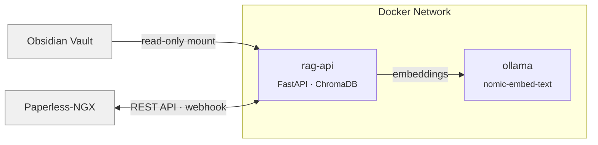

<div align="center">


# RAG API

**Self-hosted RAG for Obsidian & Paperless-NGX**

[](https://github.com/duongel/rag-api/releases)
[](https://github.com/duongel/rag-api/pkgs/container/rag-api)
[](LICENSE)
[](pyproject.toml)

Makes Obsidian notes and Paperless-NGX documents searchable for any LLM agent
via a ready-to-use [skill](./SKILL.md). Runs entirely in Docker.

</div>

---

## Installation

```bash
curl -fsSL https://raw.githubusercontent.com/duongel/rag-api/master/install.sh | bash
```

The interactive setup asks for your vault path, Paperless API credentials, Ollama location, and access mode. Safe to re-run for updates.

<details>
<summary>Manual install (development)</summary>

```bash
git clone git@github.com:duongel/rag-api.git
cd rag-api && ./start.sh
```

</details>

<details>
<summary>Docker image</summary>

Pre-built multi-arch images (`linux/amd64`, `linux/arm64`) are published on every release:

```bash
docker pull ghcr.io/duongel/rag-api:latest
```

</details>

## Agent Integration

[`SKILL.md`](./SKILL.md) contains endpoint documentation, curl examples, and copy-paste tool definitions for all major providers. Serve it as context to any LLM agent — no MCP server required.

| Provider | Format | Where to use |
|---|---|---|
| **OpenAI** | `functions` / `tools` array | ChatGPT, GPT-4o, Assistants API, Azure OpenAI |
| **Anthropic** | `tools` with `input_schema` | Claude, Claude Code, Amazon Bedrock |
| **Google** | `function_declarations` | Gemini, Vertex AI |
| **Compatible** | OpenAI format | Mistral, Groq, Ollama, Together AI, DeepSeek, Fireworks, Perplexity |

**How it works:** Copy the tool definition for your provider from [`SKILL.md`](./SKILL.md) into your agent's tool/function list. The agent calls rag-api over HTTP to search your vault and Paperless documents. Works with any framework that supports HTTP tool calls (LangChain, CrewAI, n8n, custom agents).

**Simplest approach:** Pass the full [`SKILL.md`](./SKILL.md) as system context — the agent discovers the endpoints and calls them directly.

## Architecture



- Obsidian files are watched via inotify and indexed on change
- Paperless documents are fetched via REST API; a webhook is auto-registered for real-time updates
- All data-bearing endpoints require a bearer token by default

## Access Modes

| Mode | Host port | Auth | Config |
|---|:---:|:---:|---|
| Internal, no auth | — | — | `ACCESS_MODE=internal` `AUTH_REQUIRED=false` |
| Internal + token | — | yes | `ACCESS_MODE=internal` `AUTH_REQUIRED=true` |
| Host + token | `8484` | yes | `ACCESS_MODE=host` `AUTH_REQUIRED=true` |
| Host, no auth | `8484` | — | `ACCESS_MODE=host` `AUTH_REQUIRED=false` |

## n8n Integration

Connect rag-api to n8n's Docker network (e.g. `npm-net`) with `ACCESS_MODE=internal`. n8n reaches the API directly at `http://rag-api:8080` — no exposed port, no token needed.

## Quick Reference

```bash
docker compose logs -f rag-api          # Logs
curl -X POST .../reindex                # Manual reindex
curl .../stats                          # Statistics
docker compose down                     # Stop
docker compose down -v                  # Stop + delete data
```

## Notes

| Topic | Detail |
|---|---|
| **GPU** | Metal on Apple Silicon; CUDA or CPU on Linux |
| **File Watcher** | inotify on Linux, polling on macOS (Obsidian only — Paperless uses webhooks) |
| **Paperless Webhook** | Auto-registered on startup; documents are re-indexed in real-time |
| **Data Sources** | `--obsidian-only` / `--paperless-only` to limit; default indexes both |
| **Updates** | Re-run the install command or `git pull && ./start.sh` |

## License

[MIT](LICENSE)
