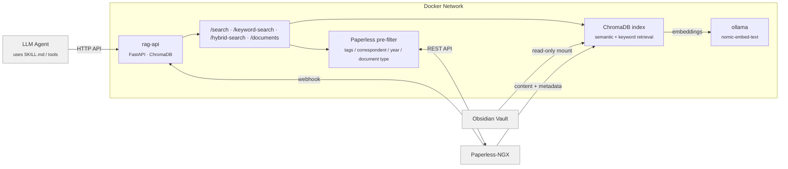

<div align="center">


# RAG API

**Self-hosted RAG for Obsidian & Paperless-NGX**

[](https://github.com/duongel/rag-api/releases)
[](https://github.com/duongel/rag-api/pkgs/container/rag-api)
[](LICENSE)
[](pyproject.toml)

Makes Obsidian notes and Paperless-NGX documents searchable for any LLM agent
via a ready-to-use [skill](./SKILL.md). Runs entirely in Docker.

</div>

---

## Installation

```bash
curl -fsSL https://raw.githubusercontent.com/duongel/rag-api/master/install.sh | bash
```
The interactive setup asks for your vault path, Paperless API credentials, Ollama location, and access mode. 

> [!TIP]
> Safe to re-run to update.

### To install with only one data source:

#### Obsidian only
```bash
curl -fsSL https://raw.githubusercontent.com/duongel/rag-api/master/install.sh | bash -s -- --obsidian-only
````

#### Paperless-ngx only
```bash
curl -fsSL https://raw.githubusercontent.com/duongel/rag-api/master/install.sh | bash -s -- --paperless-only
```


<details>
<summary>Manual install (development)</summary>

```bash
git clone git@github.com:duongel/rag-api.git
cd rag-api && ./start.sh
```

</details>

<details>
<summary>Docker image</summary>

Pre-built multi-arch images (`linux/amd64`, `linux/arm64`) are published on every release:

```bash
docker pull ghcr.io/duongel/rag-api:latest
```

</details>

## Agent Integration

[`SKILL.md`](./SKILL.md) contains endpoint documentation, curl examples, and copy-paste tool definitions for all major providers. Serve it as context to any LLM agent — no MCP server required.

Recent search additions:

- `POST /hybrid-search` combines semantic and keyword retrieval for mixed natural-language + exact-term queries
- `sort_by_date: true` supports "latest / newest" document queries
- `paperless_document_type` adds structured Paperless filtering by document type
- For Paperless questions, agents should first set the strongest available `paperless_*` filters and only then run semantic, hybrid, or keyword search on that filtered subset

| Provider | Format | Where to use |
|---|---|---|
| **OpenAI** | `functions` / `tools` array | ChatGPT, GPT-4o, Assistants API, Azure OpenAI |
| **Anthropic** | `tools` with `input_schema` | Claude, Claude Code, Amazon Bedrock |
| **Google** | `function_declarations` | Gemini, Vertex AI |
| **Compatible** | OpenAI format | Mistral, Groq, Ollama, Together AI, DeepSeek, Fireworks, Perplexity |

**How it works:** Copy the tool definition for your provider from [`SKILL.md`](./SKILL.md) into your agent's tool/function list. The agent calls rag-api over HTTP to search your vault and Paperless documents. Works with any framework that supports HTTP tool calls (LangChain, CrewAI, n8n, custom agents).

**Simplest approach:** Pass the full [`SKILL.md`](./SKILL.md) as system context — the agent discovers the endpoints and calls them directly.

Typical endpoint choices:

- Use `/search` for concepts, explanations, and broad semantic questions
- Use `/keyword-search` for abbreviations, identifiers, filenames, and exact strings
- Use `/hybrid-search` for queries like "Kaufvertrag Grundstück Montabaur" or "letzte Telekom Rechnung"
- Use `/documents` for filter-only Paperless lookups by tags, correspondent, year, or document type
- For Paperless queries, prefer `paperless_tags`, `paperless_correspondent`, `paperless_created_year`, and `paperless_document_type` before ranking

## Architecture



- Obsidian files are watched via inotify and indexed on change
- Paperless documents are fetched via REST API; a webhook is auto-registered for real-time updates
- Paperless queries can be pre-filtered by tag, correspondent, year, and document type before semantic or hybrid ranking
- `/hybrid-search` combines semantic and keyword retrieval, while `sort_by_date` supports newest-first document queries
- All data-bearing endpoints require a bearer token by default

## Access Modes

| Mode | Use case | Reachable at | Bind | Auth |
|---|---|---|---|:---:|
| **Internal** | Other containers on the same Docker network (e.g. n8n) | `http://rag-api:8080` | no port published | optional |
| **Host** | Apps on this machine only | `http://localhost:8484` | `127.0.0.1:8484` | recommended |
| **Network** | Other machines / external Paperless | `http://<your-ip>:8484` | `0.0.0.0:8484` | enforced |

> [!NOTE]
> **Network** mode binds to all interfaces and enforces authentication.
> When combined with Paperless, setup asks for the webhook callback URL so Paperless can reach rag-api.

## n8n Integration

Connect rag-api to n8n's Docker network (e.g. `npm-net`) with `ACCESS_MODE=internal`. n8n reaches the API directly at `http://rag-api:8080` — no exposed port, no token needed.

### Agent Call Budget

If your n8n AI Agent tends to over-call `rag-api`, you can enforce a hard server-side cap per user message:

```env
AGENT_MAX_CALLS_PER_MESSAGE=9
AGENT_CONVERSATION_HEADER=x-rag-conversation-id
AGENT_MESSAGE_HEADER=x-rag-message-id
```

Send both headers on every `/search`, `/keyword-search`, `/hybrid-search`, `/documents`, and `/note` request:

- `x-rag-conversation-id`: stable session/chat identifier
- `x-rag-message-id`: unique identifier for the current user message

`rag-api` persists the counter in SQLite and returns `429` once the limit is exceeded. The response also includes:

- `X-RAG-Call-Count`
- `X-RAG-Remaining-Calls`
- `X-RAG-Max-Calls`

You can inspect or reset counters via:

- `GET /agent-call-budget?conversation_id=...&message_id=...`
- `POST /agent-call-budget/reset`

## Quick Reference

```bash
docker compose logs -f rag-api          # Logs
curl -X POST .../reindex                # Manual reindex
curl .../stats                          # Statistics
docker compose down                     # Stop
docker compose down -v                  # Stop + delete data
```

## Notes

| Topic | Detail |
|---|---|
| **GPU** | Metal on Apple Silicon; CUDA or CPU on Linux |
| **File Watcher** | inotify on Linux, polling on macOS (Obsidian only — Paperless uses webhooks) |
| **Paperless Webhook** | Auto-registered on startup; documents are re-indexed in real-time |
| **Data Sources** | `--obsidian-only` / `--paperless-only` to limit; default indexes both |
| **Updates** | Re-run the install command or `git pull && ./start.sh` |

## License

[MIT](LICENSE)
